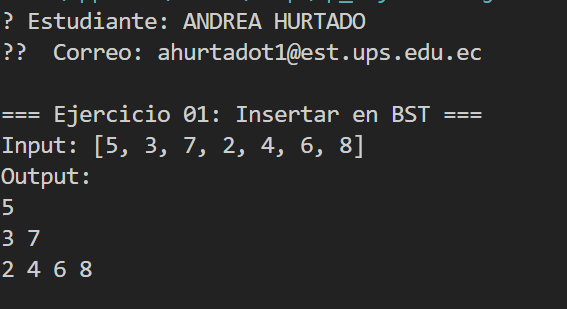
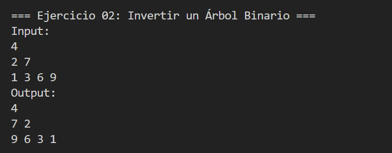
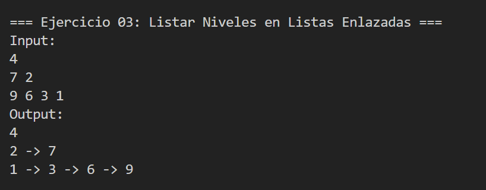
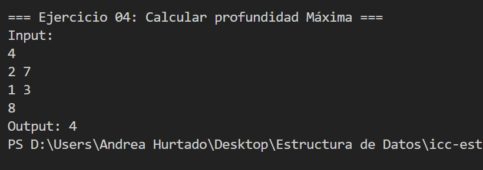

# Estructuras No Lineales – Ejercicios Árboles

Este proyecto contiene la solución a cuatro ejercicios prácticos sobre estructuras de datos tipo árbol binario, como parte del aprendizaje de estructuras no lineales en Java. Cada ejercicio se encuentra organizado en su propia carpeta, siguiendo la convención de paquetes y buenas prácticas.

```
STUDENT_NAME=ANDREA TATIANA HURTADO TOALONGO
STUDENT_EMAIL=ahurtado@est.ups.edu.ec
```


## Descripción de Ejercicios

### Ejercicio 01: Insertar en un Árbol Binario de Búsqueda (BST)

Carpeta: `Ejercicio_01_insert`
Implementa un algoritmo para insertar nodos en un Árbol Binario de Búsqueda.

 **Input de ejemplo:** `[5, 3, 7, 2, 4, 6, 8]`
 **Output esperado:**

```
    5
  3   7
 2 4 6 8
```

Compara el valor a insertar con el valor del nodo actual y decide mediante esa comparación en qué subárbol seguir, Si el valor es menor, escoge al hijo izquierdo; si es mayor, al hijo derecho. Y va descendiendo hasta encontrar una referencia nula == 0, en ese punto se crea un nuevo nodo con el valor dado y se enlaza en esa posición. Cuando el valor coincide con el del nodo, la implementación no modifica el árbol y retorna la raíz existente. Al finalizar, la función devuelve la raíz que puede ser la misma o una nueva si el árbol estaba vacío, manteniendo la propiedad de orden del arbol binario de busqueda.



### Ejercicio 02: Invertir un Árbol Binario

📂 Carpeta: `Ejercicio_02_invert`
Dada la raíz de un árbol binario, el algoritmo devuelve su versión invertida (espejo).

 **Input de ejemplo:**

```
    4
  2   7
1  3 6  9
```

**Output esperado:**

```
    4
  7   2
9  6 3  1
```

La inversión del árbol se da mediante un algoritmo recursivo que transforma cada nodo intercambiando sus hijos, para un nodo dado primero se obtiene la versión invertida de su subárbol izquierdo y la versión invertida de su subárbol derecho, luego se asigna el subárbol invertido derecho como nuevo hijo izquierdo y el subárbol invertido izquierdo como nuevo hijo derecho, en esta operación de intercambio se aplica en toda la estructura, de arriba hacia abajo, de forma que el resultado sea un árbol espejado respecto de su eje vertical, conservando la forma pero con la orientación de los hijos invertida.



### Ejercicio 03: Listar Niveles en Listas Enlazadas

📂 Carpeta: `Ejercicio_03_listLeves`
Devuelve una lista enlazada con los nodos por nivel. Si hay N niveles, se obtienen N listas.

 **Input de ejemplo:**

```
    4
  2   7
1  3 6  9
```

**Output esperado:**

```
4  
2 → 7  
1 → 3 → 6 → 9
```

La obtención de las listas por nivel usa un recorrido por anchura desde una cola, su implementación acumula para cada parte del árbol los nodos que pertenecen a ese nivel en una lista, respetando el orden de aparición de izquierda a derecha. Mientras se ejecutan los nodos de la cola, se encolan sus hijos para ser procesados en el nivel siguiente. El resultado da una colección de listas, donde cada lista representa exactamente un nivel del árbol, comenzando por la raíz y continuando hasta el último nivel de hojas.



### Ejercicio 04: Calcular la Profundidad Máxima

Carpeta: `Ejercicio_04_depth`
Calcula la profundidad máxima de un árbol binario (la longitud del camino más largo desde la raíz hasta una hoja).

**Input de ejemplo:**

```
    4
  2   7
1  3  
8
```

**Output esperado:** `4`

La profundidad máxima se calcula con una función recursiva que mide la altura de cada subárbol y combina esos resultados, para cada nodo la implementación evalúa la profundidad de su hijo izquierdo y la de su hijo derecho, y devuelve uno más que el máximo entre ambas, donde ese uno contabiliza el propio nodo. En el caso de ser una referencia nula la función retorna cero, indicando que no hay altura. Este sistema recursivo propaga las alturas desde las hojas hacia la raíz, produciendo al final un camino más largo entre la raíz y cualquier hoja del árbol.



## Autor

- [Andrea Hurtado] - Desarrollo de Algoritmos

